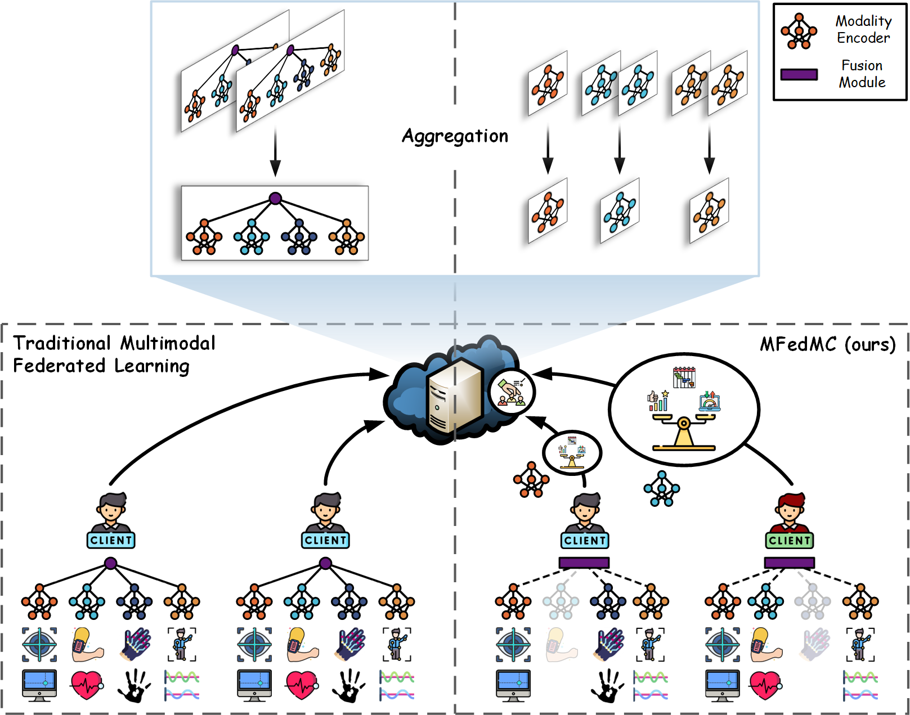

## Communication-Efficient Multimodal Federated Learning: Joint Modality and Client Selection

[](https://www.python.org/downloads/release/python-31012/)
[](https://opensource.org/licenses/MIT) 
[](https://arxiv.org/abs/2401.16685)


## 🔥 Our Framework

TL, DR: In this repo, we provide the implementation of **multimodal Federated learning with joint Modality and Client selection** (MFedMC), a novel methodology for multimodal federated learning.

<div align="center">
    
</div>


## 🖥️ Prerequisites

Install the required packages via:
```bash
pip install -r requirements.txt
```

Alternatively, ensure the following dependencies are installed:
```plaintext
python == 3.10.12
torch == 2.6.0
numpy == 1.26.4
scikit-learn == 1.5.1
shap == 0.42.1
h5py == 3.9.0
shap == 0.42.1
```

## 🗂️ Folder Structure
```
MFedMC/
│   README.md
│   requirements.txt
│
├─── ActionSense/
│   └─── dataset/
│       │   ActionSense_dataset.hdf5
│   │   main.py
│   │   utils_data.py
│   │   utils_train.py
│   │   options.py
│
│   # other datasets
```

- **`ActionSense/`**: Code for the ActionSense dataset
  - `main.py`: Main script for training and evaluating the MFedMC framework.
  - `utils_data.py`: Data loading, preprocessing, and data partitioning utilities.
  - `utils_train.py`: Functions related to model training.
  - `options.py`: Configuration settings.


## 🏃‍♂ Run Code

Run our framework with the following command:
```bash
python ActionSense/main.py
```
